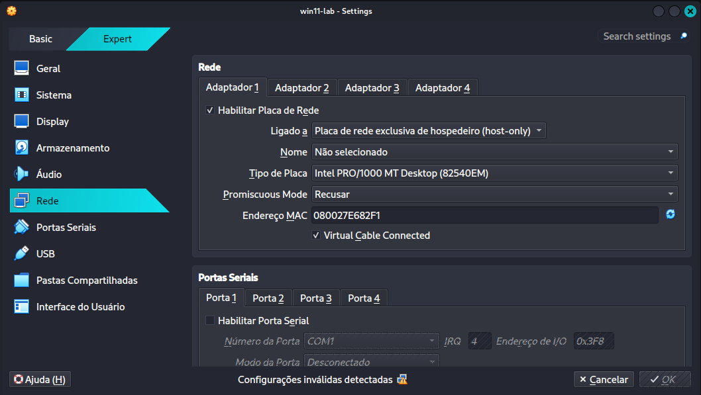
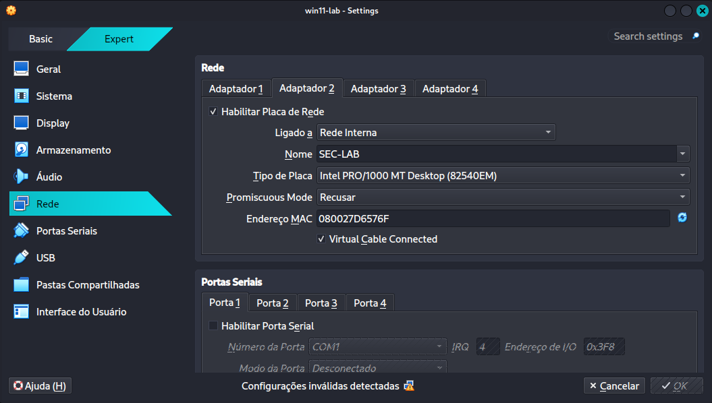

# 🌐 Configuração da Rede e Adaptadores

A arquitetura deste laboratório foi desenhada para separar o tráfego de ataque (Rede Interna) do tráfego de monitoramento e gerência (Host-Only).

## 🏗️ Arquitetura do Laboratório

```text
            ┌───────────────────────┐
            │       Kali Linux      │
            │     Wazuh Manager     │
            │    (Log Monitoring)   │
            └───────────┬───────────┘
                        │
                 Host-Only Network
                        │
                        ▼
            ┌───────────────────────┐
            │       Windows 11      │
            │         Target        │
            │      Wazuh Agent      │
            └───────────┬───────────┘
                        │
                 Internal Network
                     LAB-SEC
                        │
                        ▼
            ┌───────────────────────┐
            │        ParrotOS       │
            │        Attacker       │
            │  Nmap / Hydra / RDP   │
            └───────────────────────┘
```
## 🛠️ Detalhes dos Adaptadores no VirtualBox

Conforme o planejamento técnico, utilizamos a seguinte configuração de interfaces:

1. **Adaptador 1 (Host-Only - `vboxnet0`):** Utilizado exclusivamente para a comunicação entre os Agentes e o Manager do Wazuh.
    
   
    
2. **Adaptador 2 (Rede interna - `SEC-LAB`):** Interface dedicada para a simulação do cenário de ataque entre o ParrotOS e o Windows 11.
    
    
    

## 📍 Endereçamento IP Estático
```text
|**Máquina** |**SO**     |**IP (vboxnet0)**|**IP (SEC-LAB)**|**Função**    |
|------------|-----------|-----------------|----------------|--------------|
|**Host**    |Kali Purple|`192.168.56.1`   |-               |SIEM (Manager)|
|**Vítima**  |Windows 11 |`192.168.56.x`   |`10.10.10.10`   |Alvo (Agent)  |
|**Atacante**|ParrotOS   |-                |`10.10.10.20`   |Atacante      |
```
---

## ⚙️ Configuração da "Vulnerabilidade Proposital"

Para simular o erro humano, o Windows 11 foi configurado com:

- **RDP Ativo:** Sem Network Level Authentication (NLA).
    
- **Firewall/Defender:** Desativados.
    
- **Usuário:** `suporte` / Senha: `123456` (Permissões de Administrador).
