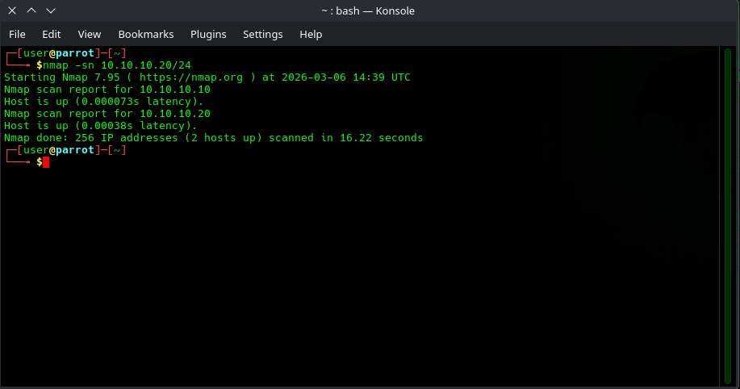
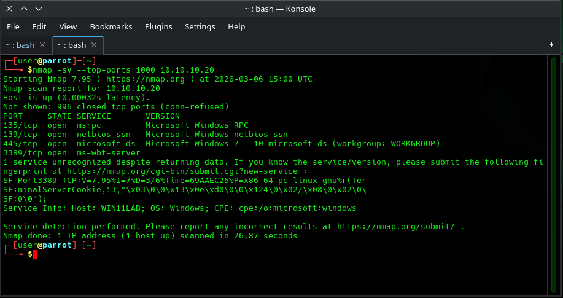
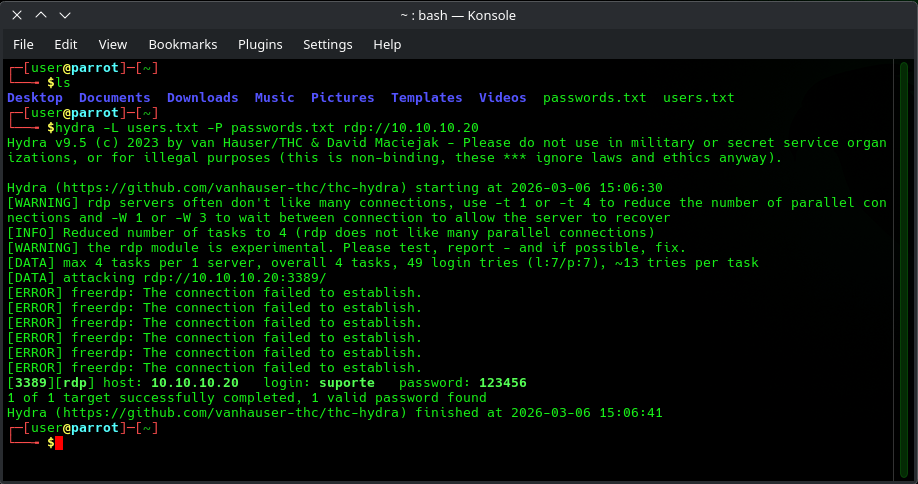
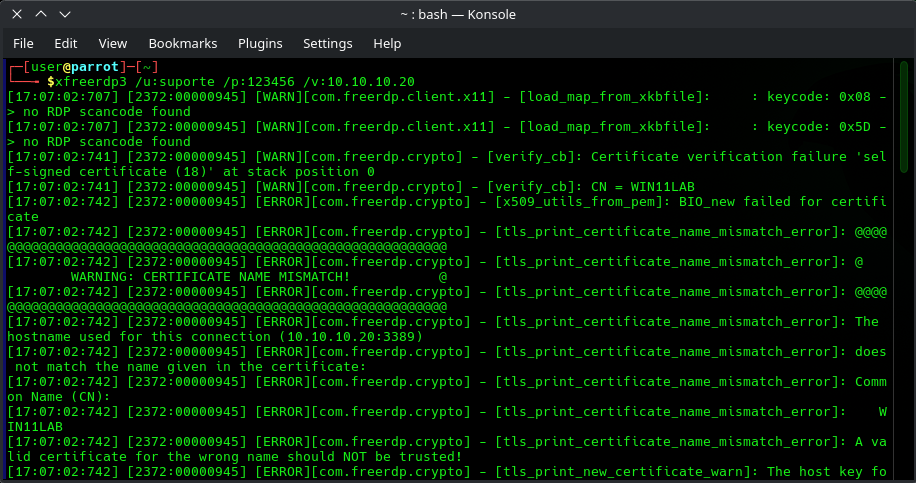
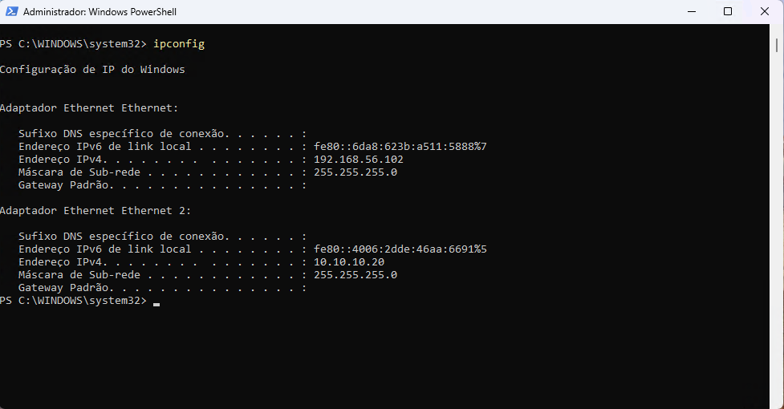

# 🔥 Fase Red Team: Reconhecimento e Exploração

Nesta fase, simulamos a atuação do atacante utilizando o ParrotOS. O objetivo foi identificar o alvo na rede interna e realizar a quebra de credenciais via força bruta no serviço RDP.

## 1. Reconhecimento (Nmap)
O primeiro passo foi realizar uma varredura para identificar os hosts ativos na rede interna **SEC-LAB**.

```bash
# Varredura para identificação de hosts
nmap -sn 10.10.10.0/24
```



Após identificar o IP `10.10.10.10` como sendo o Windows 11, realizamos uma varredura de portas para encontrar vetores de ataque:

```bash
# Verificação de serviços e portas abertas
nmap -sV -Pn 10.10.10.10
```



> **Evidência:** O scan confirmou que a porta 3389/tcp (ms-wbt-server) está aberta, confirmando a disponibilidade do protocolo RDP.

## 2. Ataque de Força Bruta (Hydra)
Utilizamos o **Hydra** para realizar um ataque de dicionário contra o serviço RDP. Para esta simulação, foram utilizadas duas wordlists simples: `users.txt` (contendo possíveis nomes de usuários) e `passwords.txt` (contendo senhas comuns).

```bash
# Execução do Brute Force com listas de usuários e senhas
hydra -L users.txt -P passwords.txt rdp://10.10.10.10
```



* **Resultado:** O ataque foi bem sucedido, retornando a senha do usuário em texto claro.

## 3. Acesso Remoto (FreeRDP)
Para consolidar a invasão e demonstrar o controle sobre a máquina alvo, utilizamos o **FreeRDP** para abrir uma sessão gráfica de terminal.

```bash
# Conexão via RDP
xfreerdp3 /u:suporte /p:123456 /v:10.10.10.10 
```



### Pós-Exploração
Com o acesso estabelecido, foi possível navegar no sistema e executar comandos via PowerShell para validar o privilégio de administrador.



---
[⬅️ Voltar para o Início](../README.md) | [Ir para Fase Blue Team ➡️](03-fase-defensiva.md)
