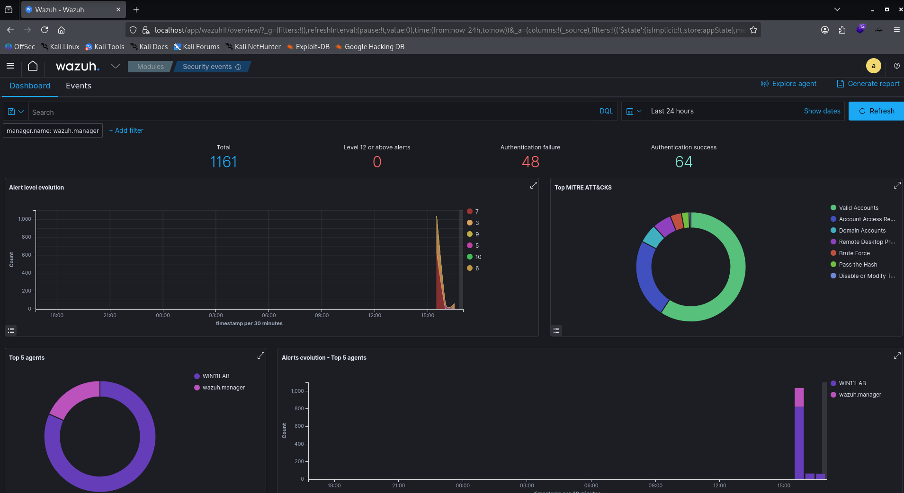
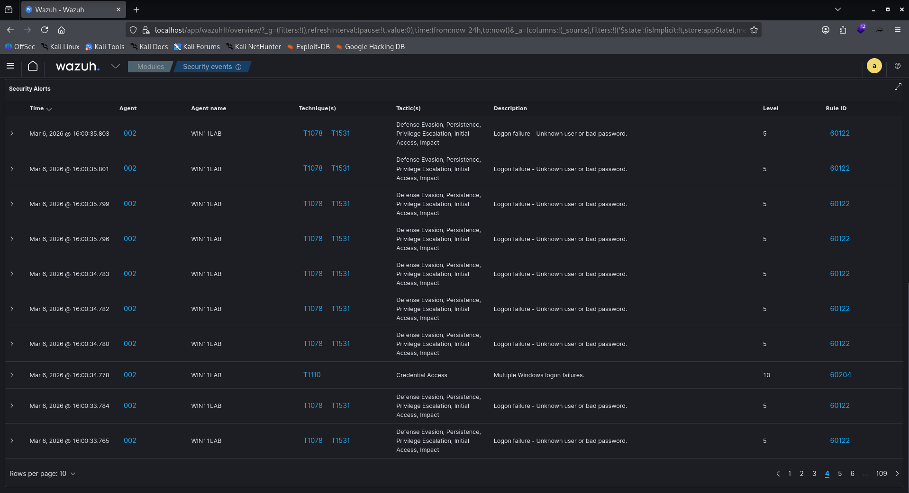
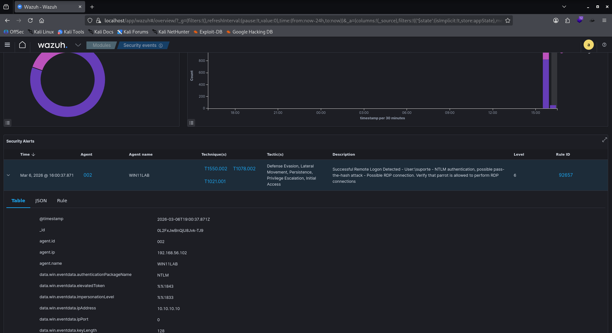
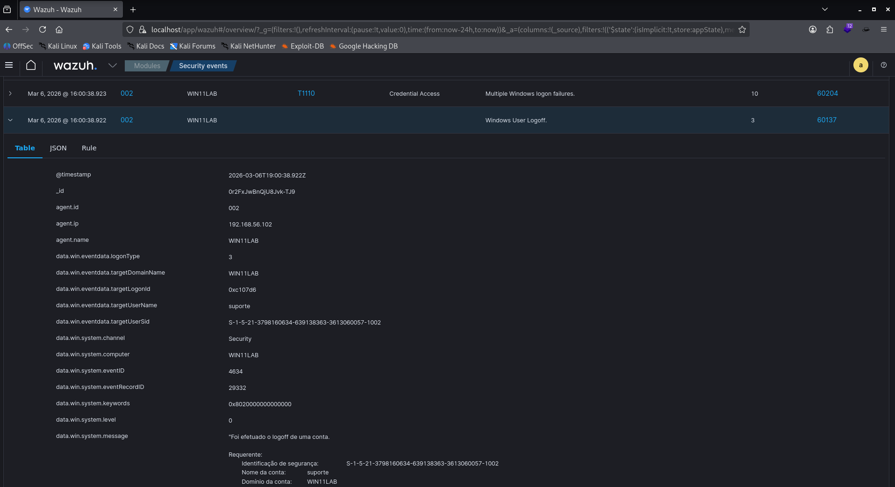

# 🛡️ Fase Blue Team: Coleta e Análise de Logs

A máquina Windows é monitorada pelo **Wazuh Agent**, que envia os logs para o Host Kali Linux onde o **Wazuh Manager** está rodando. Nesta fase, analisamos os logs e códigos de eventos gerados durante o ataque de força bruta.

## 📊 Painel Geral de Eventos
Este é o ponto de partida da análise, onde observamos o comportamento anómalo na rede através do dashboard do SIEM.

> **Visão Geral:** Dashboard do Wazuh exibindo o volume total de eventos e a severidade dos alertas gerados durante a atividade do Red Team.

---

## 🚨 Análise Detalhada por Eventos

### 1. Detecção de Tentativas de Brute-Force
Foram detectadas várias tentativas seguidas de login com erro de senha ou usuário, o que caracteriza um ataque automatizado.

* **ID da Regra:** 60122 / 60204 (Multiple Windows Logon Failure)
* **MITRE ATT&CK:** T1110 (Brute Force)
* **Observação:** Nota-se que a cada 07 tentativas sem sucesso, um alerta de falha múltipla era gerado. Ao todo, foram registradas 42 tentativas.

### 2. Login RDP Bem-Sucedido
Este log confirma que o atacante conseguiu quebrar a credencial e obter acesso remoto ao sistema.

* **ID da Regra:** 92657 (Remote Desktop (RDP) Successful Logon)
* **MITRE ATT&CK:** T1021.001 (Remote Services: Remote Desktop Protocol)
* **IP do Atacante:** 10.10.10.20 (ParrotOS)

### 3. Encerramento de Sessão (Logout)
Log que indica o encerramento da atividade logo após o sucesso, reforçando o padrão de ataque automatizado que apenas valida as credenciais.

* **ID da Regra:** 60137 (Windows User Logoff)
* **Análise:** O logout imediato após o sucesso é um comportamento típico de scripts de força bruta.

---

## 🔍 Conclusão da Visibilidade e Gaps
Apesar da detecção eficaz dos logins, os comandos de pós-acesso via PowerShell realizados pelo atacante não dispararam alertas no dashboard padrão. Isso demonstra a importância de:

1. **Implementação de regras customizadas:** Para detectar comandos específicos de enumeração.
2. **Ativação de monitoramento avançado:** Configurar o *Script Block Logging* do PowerShell via GPO no Windows.
3. **Análise comportamental:** Monitorar processos filhos suspeitos originados do serviço de RDP.

---
[⬅️ Fase Ofensiva](02-fase-ofensiva.md) | [Ir para Mitigações e Conclusão ➡️](04-mitigacao-conclusao.md)
